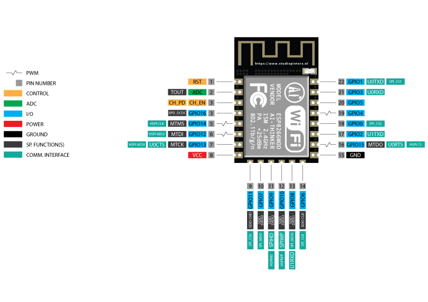

# almond-hw

    Project almond hardware esp8266 control code for hydroponics system

  

  #### Simple but complicated almond iot

## Description
This is a hydroponics farm control system to be used at home with limited space, in greenhouses and indoors as well.

### Application Heroku Links

-   Backend (Swagger Documentation):
    [swagger-documentation](https://almond-re-staging.herokuapp.com/)

-   Frontend (Almond App Hosting):
    [almond web app](https://almond-re-staging.herokuapp.com/)

-   Postman collection
     
     
    

### Development set up
1. Install [`PlatformIO`](https://docs.platformio.org/en/latest/ide/vscode.html#ide-vscode) and set up on VSCode.
2. To clone, run `https://github.com/mashafrancis/almond-hw.git`.
3. `cd` into the root of the **project directory**.
4. Upload the file from src to the esp32 board by using `platformio run`

### ESP 8266 Datasheet
[Datasheet Download](https://circuits4you.com/wp-content/uploads/2018/12/esp32-wroom-32_datasheet_en.pdf)

### ESP 8266 Pinout
 

 

## Testing

**Unit tests** - Run `platformio test -e nodemcuv2 -v` on the terminal while within the **project root directory**. Unit testing is achieved through the use of `platformio`.

### Support or Contribution

For any suggestions or contributions please do not hesitate to contact the owners of this repository.

Contributions to this project are welcomed by all, If you need to contribute, follow the steps below

- **Fork** the repository
- Follow [Installation and Setup](#installation) as explained earlier
- Create a branch off `develop` for the feature you wish to add
- Make necessary changes, commit and raise a pull request against develop, conventions can be found on the [wiki page](https://github.com/mashafrancis/almond-hw/wiki).
  **Note** when making contributions, please endeavour to follow the [CppCoreGuidelines](https://github.com/isocpp/CppCoreGuidelines/blob/master/CppCoreGuidelines.md) C++ and Arduino style guide. Also make sure to follow the [Almond Guide](https://github.com/mashafrancis/almond-hw/wiki) for conventions.

## FAQ
See the almond [wiki](https://github.com/mashafrancis/almond-hw/wiki)
